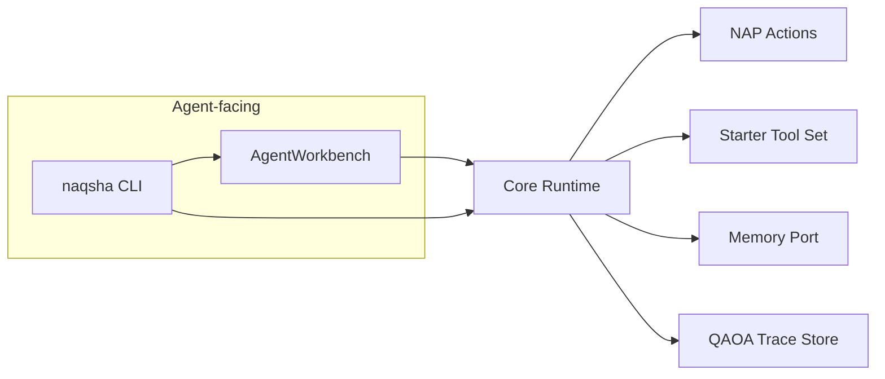

# NAQSHA

**Inspectable agent runtime for Python.** NAQSHA gives you a production-shaped **Core Runtime** with validated **NAP Actions**, append-only **QAOA Traces**, enforced **Tool Policy**, explicit **Approval Gates**, and durable **Memory Port** adapters—not a thin wrapper around a chat API.

PyPI distribution, Python import package, and CLI entry point are all spelled **`naqsha`**.

---

## Why NAQSHA

| You need | What you get |
|----------|----------------|
| **Truth that survives prompting** | A **QAOA Trace** (Query · Action · Observation · Answer) is the canonical record, not an API chat log. |
| **Safety beyond "please behave"** | **Tool Policy** and **Approval Gates** are runtime-enforced; side effects route through tiers and human checkpoints. |
| **Untrusted tool output** | **Observation Sanitizer** runs before traces, prompts, or memory see tool payloads. |
| **Regression without flakiness** | Trace **replay** with recorded observations by **`call id`**, plus schema-versioned **eval** fixtures. |
| **Improvement without hot-patching prod** | The **Reflection Loop** writes isolated **Reflection Patches** for **human review** only—nothing auto-merges. |

Read the glossary in **[CONTEXT.md](CONTEXT.md)** for exact vocabulary when filing issues or designing extensions.

---

## Documentation

Full guides (install, architecture, profiles, embedding, replay, reflection) ship in-repo and inside the source distribution:

| Resource | Contents |
|----------|-----------|
| **[User guide hub](docs/user-guide/README.md)** | Start here: getting started → architecture → CLI & profiles → Python API |
| **[Example Run Profiles](examples/profiles/README.md)** | Remote model adapters, paths, **`api_key_env`** (never inline secrets) |
| **[Architectural decisions](docs/adr/)** | Locked-in choices backing the terminology above |

On GitHub without a checkout: **[Documentation tree](https://github.com/KM-Alee/naqsha/tree/main/docs/user-guide)**.

---

## Install

```bash
python -m pip install naqsha
naqsha --version   # same as: python -m naqsha --version
```

**Developers** (tests + Ruff) from a clone:

```bash
uv sync --extra dev
uv run --extra dev pytest
uv run --extra dev ruff check .
```

Credential names (not values) belong in **`api_key_env`** inside profiles. Copy **[`.env.example`](.env.example)** to `.env` locally if your workflow uses dotenv loaders—never commit real keys.

---

## Five-minute CLI tour

Bundled **`local-fake`** needs no project layout and performs deterministic runs offline:

```bash
naqsha run --profile local-fake --human "ping"
```

For a real **`workbench`** project under `.naqsha/`:

```bash
mkdir demo && cd demo
naqsha init
naqsha run --profile workbench --human "hello"

# Inspect the latest trace
naqsha replay --profile workbench --latest --human

# Regression: snapshot then verify (use run_id from JSON stdout or the stderr replay hint after `run`)
naqsha eval save --profile workbench <run_id> smoke
naqsha eval check --profile workbench <run_id> --name smoke

# Reflection workspace (human review required; see docs/user-guide/04-library-traces-eval-and-reflection.md)
naqsha reflect --profile workbench <run_id>
```

`naqsha run` prints structured JSON on **stdout** by default (`--human` prints the answer only). Inspect effective policy **before** turning on approvals:

```bash
naqsha profile show --profile workbench
naqsha tools list --profile workbench
```

---

## Concept map



---

## Library quick start

```python
from naqsha import AgentWorkbench, build_runtime, load_run_profile

# High-level façade
wb = AgentWorkbench.from_profile_spec("workbench")
result = wb.run("hello")

# Direct Core Runtime wiring
runtime = build_runtime(load_run_profile("local-fake"))
runtime.run("ping")
```

Exports and semantics: **[Library guide](docs/user-guide/04-library-traces-eval-and-reflection.md)**.

---

## CLI reference (short)

| Command | Role |
|---------|------|
| `naqsha init` | Create `.naqsha/` directories and default **`workbench`** profile |
| `naqsha run QUERY` | Execute a turn loop; **`--approve-prompt`**, **`--human`**, profile overrides |
| `naqsha replay [RUN_ID]` | Summarize a trace; **`--latest`**; **`--re-execute`** for regression replay |
| `naqsha trace inspect` | Same summaries as **`replay`** without re-execution |
| `naqsha profile show` / `inspect-policy` | Resolved **Run Profile** + **Tool Policy** JSON |
| `naqsha tools list` | Allowed tools + risk metadata |
| `naqsha eval save` / `eval check` | `.naqsha/evals/` fixtures |
| `naqsha reflect` / `improve` | Reflection **Patch** workspace (review-only) |

Default **`--profile`** is **`local-fake`**; after **`naqsha init`** use **`workbench`**.

---

## Repository layout hints

| Path | Meaning |
|------|---------|
| `src/naqsha/` | **Core Runtime**, wiring, adapters, CLI |
| `docs/user-guide/` | Human-oriented documentation |
| `examples/profiles/` | Copy‑paste Run Profile starters |
| `sandbox/` | Optional manual / paid‑API experiments—not required to use the library |

---

## License

MIT — see **[LICENSE](LICENSE)**.
