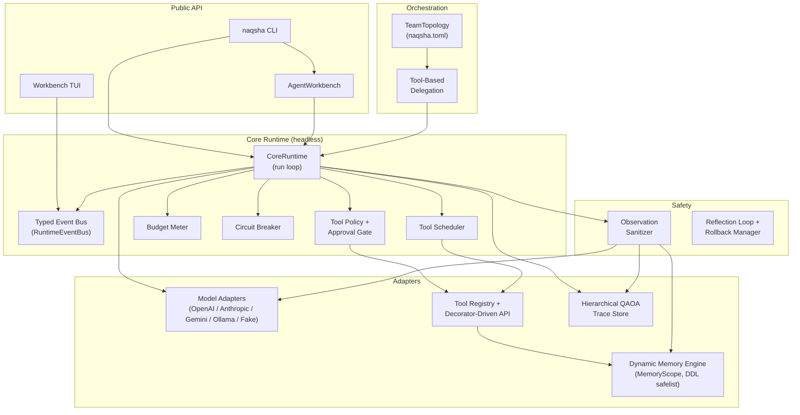

<div align="center">

# NAQSHA

**Inspectable Python agent runtime with strict tool contracts, hierarchical traces, dynamic memory, and a rich Workbench TUI.**

[](https://pypi.org/project/naqsha/)
[](https://pypi.org/project/naqsha/)
[](https://github.com/KM-Alee/naqsha/actions/workflows/ci.yml)
[](LICENSE)
[](https://km-alee.github.io/naqsha/)

</div>

---

NAQSHA is a **production-shaped Python agent runtime**—not a thin wrapper around a chat API. It gives you a headless **Core Runtime** with enforced **Tool Policy**, append-only **Hierarchical QAOA Traces**, explicit **Approval Gates**, a **Dynamic Memory Engine**, **multi-agent Team Workspaces**, autonomous **Reflection Patches**, and a beautiful **Workbench TUI**. Every design decision is documented in an ADR; every safety invariant is runtime-enforced.

> **PyPI distribution, `import` package, and CLI entry-point are all spelled `naqsha`.**

---

## Table of contents

- [Why NAQSHA](#why-naqsha)
- [Feature overview](#feature-overview)
- [Install](#install)
- [Five-minute quick start](#five-minute-quick-start)
- [Library quick start](#library-quick-start)
- [Multi-agent teams](#multi-agent-teams)
- [Defining tools](#defining-tools)
- [Memory](#memory)
- [Traces and replay](#traces-and-replay)
- [Reflection and rollback](#reflection-and-rollback)
- [Workbench TUI](#workbench-tui)
- [CLI reference](#cli-reference)
- [Configuration reference](#configuration-reference)
- [Architecture](#architecture)
- [Repository layout](#repository-layout)
- [Contributing](#contributing)
- [License](#license)

---

## Why NAQSHA

Most "agent frameworks" are wrappers around a chat API with a tool-calling loop bolted on. NAQSHA is different in ways that matter in production:

| You need | What you get |
|---|---|
| **An auditable record that survives prompting** | A **QAOA Trace** (Query → Action → Observation → Answer) is the canonical record, not an API chat log. Every run is an append-only JSONL file. |
| **Safety beyond "please behave"** | **Tool Policy** and **Approval Gates** are runtime-enforced. Risky side-effects route through tiered gates and human checkpoints — not prompt instructions. |
| **Untrusted tool output** | The **Observation Sanitizer** runs before traces, prompts, and memory ever see tool payloads. Tool output informs the model; it cannot instruct the runtime. |
| **Regression without flakiness** | **Trace replay** re-executes against recorded observations indexed by `call_id`. Schema-versioned **eval fixtures** catch regressions deterministically. |
| **Multi-agent coordination without a graph engine** | The **Tool-Based Delegation Model** auto-generates `delegate_to_<worker>` tools for the orchestrator. No state machines, no graph routers. |
| **Improvement without hot-patching prod** | The **Reflection Loop** writes isolated **Reflection Patches** that require a **Reliability Gate** pass before any merge. |
| **Costs that don't spiral** | **Budget Limits** (steps, tokens, tool calls, wall time) fail closed. Exhausted budgets produce structured failures, not soft warnings. |
| **Runaway agents that stop themselves** | The **Circuit Breaker** trips on repeated identical tool failures and escalates cleanly to the orchestrator via structured `TaskFailedError` observations. |

---

## Feature overview

### Core Runtime
- ReAct agent loop executing validated **NAP V2 Actions**
- **Typed Event Bus** — 14 Pydantic event types (`RunStarted`, `ToolInvoked`, `SpanOpened`, `BudgetProgress`, …) for live observation without coupling
- **Tool Policy** — allow/deny lists with risk tiers (`read`, `write`, `side-effect`); **Approval Gates** block execution until approved
- **Budget Meter** — hard caps on steps, tokens, tool calls, and wall-clock time; all fail closed
- **Circuit Breaker** — consecutive failure tracking per tool; configurable threshold; disabled during replay
- Serial and parallel **Tool Scheduler**

### Decorator-Driven API
```python
from naqsha.tools import agent, AgentContext

@agent.tool(risk_tier="read", description="Return the current UTC time.")
def clock(ctx: AgentContext) -> str:
    from datetime import datetime, UTC
    return datetime.now(UTC).isoformat()
```
- JSON Schema Draft 2020-12 generated from type hints at import time
- Supports `str`, `int`, `float`, `bool`, `Optional[T]`, `list[T]`, `dict[str, T]`, Pydantic `BaseModel`, `async def`
- `AgentContext` parameters auto-injected; omitted from the public schema
- `ToolDefinitionError` raised at decoration time for malformed signatures — no silent runtime failures

### Hierarchical QAOA Trace (V2 schema)
- Every event carries `trace_id`, `span_id`, `parent_span_id`, `agent_id`
- Multi-agent delegation produces a nested span tree readable in the Workbench TUI
- V1 traces are auto-upgraded on load (backward-compatible reads)
- `TraceStore` is append-only; no rewrite, no truncation

### Dynamic Memory Engine
- SQLite-backed with WAL mode
- **Shared Memory** (`shared_*` tables) — readable by all agents in a team
- **Private Memory** (`private_<agent_id>_*` tables) — isolated at the SQL level; other agents cannot query it
- **DDL safelist** — `CREATE TABLE`, `CREATE INDEX`, `ALTER TABLE ADD COLUMN` only; destructive DDL raises `ForbiddenDDLError`
- Token-budgeted retrieval with keyword + recency ranking
- Optional `sqlite-vec` semantic embeddings (`[memory]` extra)

### Multi-Agent Team Workspaces
- `naqsha.toml` — single file defines all agents, roles, model adapters, tool allowlists, budgets, memory, and reflection settings
- **Role-Based Tool Policy** — each agent has a strict tool allowlist; cross-agent leaks are impossible
- **Worker isolation** — the orchestrator's `AgentContext` is never passed to a worker; delegation runs a fully isolated nested runtime
- Hierarchical traces share `run_id`; each agent gets its own `agent_id` and `span_id`

### Reflection Loop and Automated Rollback Manager
- Generates isolated **Reflection Patches** from evaluated traces
- Runs **Reliability Gate** (pytest over gate paths) before any merge
- **`auto_merge = false`** is always the default — opt-in only
- **Automated Rollback Manager** snapshots the workspace before autonomous merges; restores on failed boot probe

### Workbench TUI
- **Textual-based** rich TUI (`[tui]` optional extra)
- Live **Chat**, **Budget**, **Span Tree**, **Flame Graph**, **Memory Browser**, and **Patch Review** panels
- Subscribes to the **Typed Event Bus** — zero coupling to core
- `naqsha init` interactive wizard for workspace setup
- `NAQSHA_NO_TUI=1` forces plain output; TUI never imported unless explicitly enabled

---

## Install

```bash
# Core runtime (no extra dependencies beyond Pydantic)
pip install naqsha

# With TUI (Textual + Rich)
pip install "naqsha[tui]"

# With memory embeddings (sqlite-vec)
pip install "naqsha[memory]"

# Everything
pip install "naqsha[tui,memory]"
```

Confirm the install:

```bash
naqsha --version
python -c "import naqsha; print(naqsha.__version__)"
```

### Developer setup (from a clone)

```bash
git clone https://github.com/KM-Alee/naqsha.git
cd naqsha
uv sync --extra dev
uv run naqsha --version
```

Run the full test suite and linter:

```bash
uv run pytest          # all tests (fake models, no API keys needed)
uv run ruff check .    # zero lint errors required
uv run mkdocs build --strict   # docs build check
```

---

## Five-minute quick start

### Offline run (no API keys)

NAQSHA ships a **`local-fake`** Run Profile that uses a scripted model client — perfect for CI, testing, and local development without any API keys:

```bash
naqsha run --profile local-fake --human "ping"
```

### Initialise a workspace

```bash
mkdir my-agent && cd my-agent
naqsha init          # interactive wizard → writes naqsha.toml
naqsha run --profile workbench --human "hello"
```

### Inspect a trace

```bash
# Show the latest trace
naqsha replay --profile workbench --latest --human

# Re-execute against recorded observations (regression replay)
naqsha replay --profile workbench --latest --re-execute
```

### Snapshot and verify regressions

```bash
# Save a regression fixture (get run_id from stdout JSON or stderr hint)
naqsha eval save --profile workbench <run_id> smoke

# Verify: re-run and check outputs match
naqsha eval check --profile workbench <run_id> --name smoke
```

### Reflection Patch (review-only by default)

```bash
naqsha reflect --profile workbench <run_id>
# → creates an isolated patch workspace; human review required before any merge
```

---

## Library quick start

```python
from naqsha import build_runtime, load_run_profile

# Direct Core Runtime wiring — uses bundled fake model, no API keys
runtime = build_runtime(load_run_profile("local-fake"))
result = runtime.run("What is 2 + 2?")
print(result.answer)   # "4"
print(result.failed)   # False
```

### With the event bus

```python
from naqsha import build_runtime, load_run_profile, RuntimeEventBus
from naqsha.core.events import ToolInvoked, RunCompleted

bus = RuntimeEventBus()

@bus.subscribe
def on_tool(event: ToolInvoked):
    print(f"→ tool called: {event.tool_name}")

@bus.subscribe
def on_done(event: RunCompleted):
    print(f"✓ run done: {event.answer}")

runtime = build_runtime(load_run_profile("local-fake"), event_bus=bus)
runtime.run("ping")
```

### High-level `AgentWorkbench` façade

```python
from naqsha import AgentWorkbench

wb = AgentWorkbench.from_profile_spec("workbench")
result = wb.run("Summarise the latest logs")
print(result.answer)
```

### Multi-agent team (Python API)

```python
from pathlib import Path
from naqsha.orchestration.team_runtime import build_team_orchestrator_runtime
from naqsha.orchestration.topology import parse_team_topology_file

root = Path("my-team-workspace")
topo = parse_team_topology_file(root / "naqsha.toml")
rt = build_team_orchestrator_runtime(topo, root)
result = rt.run("Research and summarise topic X")
print(result.answer)
```

---

## Multi-agent teams

Create a `naqsha.toml` in your workspace root:

```toml
[workspace]
name       = "research-team"
orchestrator = "orch"
auto_approve = false

[memory]
db_path = ".naqsha/memory.db"

[reflection]
enabled    = true
auto_merge = false   # always false by default; opt-in only

[agents.orch]
role          = "orchestrator"
model_adapter = "openai_compat"
tools         = ["clock", "list_memory_tables"]

[agents.orch.openai_compat]
model       = "gpt-4o"
api_base    = "https://api.openai.com/v1"
api_key_env = "OPENAI_API_KEY"   # environment variable name — never the value

[agents.researcher]
role          = "worker"
model_adapter = "openai_compat"
tools         = ["clock", "read_file", "list_memory_tables", "memory_schema"]
max_retries   = 3

[agents.researcher.openai_compat]
model       = "gpt-4o-mini"
api_base    = "https://api.openai.com/v1"
api_key_env = "OPENAI_API_KEY"
```

Key invariants:
- **Worker isolation is absolute.** The orchestrator's `AgentContext` is never passed to a worker.
- **Role-Based Tool Policy.** Each agent only has the tools listed in its `tools` array; others are denied with a `ToolErrored` event.
- **Shared memory** (`shared_*` tables) is accessible by all agents; **private memory** (`private_<agent_id>_*`) is SQL-level isolated.
- All trace events share the same `run_id`; `agent_id` + `parent_span_id` distinguish the hierarchy.

### Supported model adapters

| Adapter key | Provider | Notes |
|---|---|---|
| `fake` | Built-in scripted responses | No API keys; use for tests |
| `openai_compat` | OpenAI, Azure, Together, Groq, … | Any OpenAI-compatible `/chat/completions` endpoint |
| `anthropic` | Anthropic Claude | `ANTHROPIC_API_KEY` |
| `gemini` | Google Gemini | `GOOGLE_API_KEY` |
| `ollama` | Local Ollama | `base_url` override for custom installs |

---

## Defining tools

```python
from naqsha.tools import agent, AgentContext
from pydantic import BaseModel

class SearchParams(BaseModel):
    query: str
    max_results: int = 10

@agent.tool(risk_tier="read", description="Search a knowledge base.")
async def search_kb(params: SearchParams, ctx: AgentContext) -> list[dict]:
    scope = ctx.shared_memory
    rows = scope.query(
        "SELECT title, body FROM shared_articles WHERE body LIKE ?",
        (f"%{params.query}%",),
    )
    return [{"title": r[0], "snippet": r[1][:200]} for r in rows[: params.max_results]]
```

### Risk tiers

| Tier | Meaning | Default gate |
|---|---|---|
| `read` | Read-only; no side effects | No approval required |
| `write` | Writes data or state | Configurable; `InteractiveApprovalGate` in interactive mode |
| `side-effect` | External side effects (email, API call, …) | Requires explicit approval |

### AgentContext

`AgentContext` is the stable public API for tools — the only way to access runtime state:

| Field | Type | Description |
|---|---|---|
| `agent_id` | `str` | Current agent identifier |
| `run_id` | `str` | Unique run identifier |
| `workspace_path` | `Path \| None` | Workspace root directory |
| `shared_memory` | `MemoryScope \| None` | Team-wide memory (`shared_*` tables) |
| `private_memory` | `MemoryScope \| None` | Agent-private memory (`private_<agent_id>_*`) |
| `span` | `Span \| None` | Active trace span for metrics |

---

## Memory

NAQSHA's **Dynamic Memory Engine** persists agent knowledge in SQLite:

```python
from naqsha.memory import DynamicMemoryEngine

engine = DynamicMemoryEngine(".naqsha/memory.db")
shared = engine.get_shared_scope()

# Schema evolution — agents can CREATE, but not DROP
shared.execute(
    "CREATE TABLE IF NOT EXISTS shared_notes (id INTEGER PRIMARY KEY, content TEXT, created_ts INTEGER)"
)

# Write
shared.execute(
    "INSERT INTO shared_notes (content, created_ts) VALUES (?, strftime('%s','now'))",
    ("Learned that X implies Y",),
)

# Token-budgeted retrieval
from naqsha.memory import MemoryRetriever
retriever = MemoryRetriever(shared, token_budget=512)
results = retriever.retrieve("what implies Y")
```

**DDL safelist** — the following are always rejected:

```python
shared.execute("DROP TABLE shared_notes")  # → ForbiddenDDLError
shared.execute("DELETE FROM shared_notes") # → permitted (DML is fine)
```

---

## Traces and replay

Every run writes an append-only JSONL trace. Each event carries:

```json
{
  "schema_version": 2,
  "kind": "observation",
  "trace_id": "abc123",
  "span_id": "span_orch_001",
  "parent_span_id": null,
  "agent_id": "orch",
  "run_id": "abc123",
  "tool_name": "clock",
  "call_id": "c1",
  "payload": "2026-05-03T17:00:00+00:00",
  "ts": 1746291600.0
}
```

### Replay a trace

```bash
# Human-readable summary
naqsha replay --profile workbench --latest --human

# Re-execute against recorded observations (deterministic; no API calls)
naqsha replay --profile workbench --latest --re-execute
```

### Programmatic replay

```python
from naqsha import build_trace_replay_runtime, load_run_profile
from naqsha.tracing.store import JsonlTraceStore

store = JsonlTraceStore(".naqsha/traces")
trace = store.load_latest()

runtime = build_trace_replay_runtime(trace, load_run_profile("local-fake"))
result = runtime.run(trace.query)
assert result.answer == trace.answer
```

---

## Reflection and rollback

The **Reflection Loop** generates isolated **Reflection Patches** from evaluated traces:

```bash
# Generate a patch workspace from a trace
naqsha reflect --profile workbench <run_id>

# Review the patch (human approval required by default)
# → opens PatchReviewPanel in the Workbench TUI, or prints diff to stdout
```

### Auto-merge (opt-in)

Enable in `naqsha.toml`:

```toml
[reflection]
enabled          = true
auto_merge       = true                  # opt-in; false by default
reliability_gate = true                  # run pytest before merge
gate_paths       = ["tests/smoke/"]
```

The **Reliability Gate** runs pytest over `gate_paths`. If it fails, the patch is discarded. If it passes, the **Automated Rollback Manager** snapshots the workspace before applying the merge. If the next `naqsha run` fails the boot probe, the workspace is restored from snapshot and `PatchRolledBack` is emitted on the Event Bus.

---

## Workbench TUI

Install the `[tui]` extra, then launch:

```bash
pip install "naqsha[tui]"
naqsha run --profile workbench "Analyse the latest traces"
```

The TUI opens automatically when stdin/stdout are TTYs and `textual` is installed. Force plain output at any time:

```bash
NAQSHA_NO_TUI=1 naqsha run --profile workbench "hello"
```

### Panels

| Panel | Description |
|---|---|
| **Chat** | Streaming token output; tool call log; run lifecycle |
| **Budget** | Live steps / tool calls / wall-clock progress bars |
| **Span Tree** | Expandable trace tree built from `SpanOpened` / `SpanClosed` events |
| **Flame Graph** | Per-agent wall time and token totals |
| **Memory Browser** | Read-only SQLite table viewer for the workspace DB |
| **Patch Review** | Diff view with Approve / Reject for Reflection Patches |

### `naqsha init` wizard

```bash
mkdir new-project && cd new-project
naqsha init
```

Interactive step-by-step wizard that generates a valid `naqsha.toml` for single-agent or multi-agent workspace.

---

## CLI reference

```
naqsha [--profile PROFILE] <command> [options]
```

| Command | Description |
|---|---|
| `naqsha init` | Interactive workspace wizard → writes `naqsha.toml` |
| `naqsha run QUERY` | Execute a run; `--human` for plain text, `--approve-prompt` for interactive approval |
| `naqsha replay [RUN_ID]` | Summarise a trace; `--latest`; `--re-execute` for deterministic replay |
| `naqsha trace inspect [RUN_ID]` | Summarise without re-executing |
| `naqsha profile show` | Print resolved Run Profile JSON |
| `naqsha profile inspect-policy` | Print effective Tool Policy |
| `naqsha tools list` | List allowed tools with risk tiers |
| `naqsha eval save RUN_ID NAME` | Snapshot run as regression fixture |
| `naqsha eval check RUN_ID --name NAME` | Verify run against saved fixture |
| `naqsha reflect RUN_ID` | Generate Reflection Patch workspace |
| `naqsha improve RUN_ID` | Alias for `reflect` |

Default profile is `local-fake`. After `naqsha init`, use `workbench`.

---

## Configuration reference

### `naqsha.toml` (Team Workspace)

```toml
[workspace]
name         = "my-team"
orchestrator = "orch"    # agent id of the orchestrator
auto_approve = false     # approve all write-tier tools automatically

[memory]
db_path = ".naqsha/memory.db"

[reflection]
enabled          = true
auto_merge       = false  # ALWAYS false by default
reliability_gate = true
gate_paths       = ["tests/"]

[agents.orch]
role          = "orchestrator"
model_adapter = "openai_compat"  # fake | openai_compat | anthropic | gemini | ollama
tools         = ["clock", "list_memory_tables"]
max_retries   = 3
max_steps     = 20
max_tokens    = 4096

[agents.orch.openai_compat]
model       = "gpt-4o"
api_base    = "https://api.openai.com/v1"
api_key_env = "OPENAI_API_KEY"   # env var name — NEVER the key itself
```

### JSON Run Profile (single-agent, legacy)

```json
{
  "profile": "workbench",
  "model_adapter": "openai_compat",
  "model": "gpt-4o",
  "api_base": "https://api.openai.com/v1",
  "api_key_env": "OPENAI_API_KEY",
  "tools": ["clock", "read_file", "list_files"],
  "trace_dir": ".naqsha/traces",
  "max_steps": 10,
  "max_tokens": 2048
}
```

### Environment variables

| Variable | Description |
|---|---|
| `NAQSHA_NO_TUI` | Set to `1` to force plain JSON/text output |
| `OPENAI_API_KEY` | OpenAI-compatible key (referenced by `api_key_env`) |
| `ANTHROPIC_API_KEY` | Anthropic key |
| `GOOGLE_API_KEY` | Google Gemini key |

---

## Architecture



### Module ownership

| Package | Owns |
|---|---|
| `naqsha.core` | Headless run loop, Event Bus, Tool Policy, Approval Gate, Budget Meter, Circuit Breaker, Tool Scheduler |
| `naqsha.models` | NAP V2 protocol, Model Adapters, Trace→NAP replay |
| `naqsha.tools` | Decorator-Driven API, ToolRegistry, ToolExecutor, AgentContext |
| `naqsha.memory` | Dynamic Memory Engine, MemoryScope, DDL safelist, MemoryRetriever |
| `naqsha.orchestration` | TeamTopology, Tool-Based Delegation, team runtime builders |
| `naqsha.tracing` | Hierarchical QAOA Trace, SpanContext, TraceStore, Observation Sanitizer |
| `naqsha.reflection` | Reflection Loop, Automated Rollback Manager, Reliability Gate |
| `naqsha.tui` | Workbench TUI, init wizard, all panels |

**Invariant:** `core/` never imports from `tui/`. The core is headless.

---

## Repository layout

```
naqsha/
├── src/naqsha/
│   ├── core/          # CoreRuntime, Event Bus, Policy, Budget, Circuit Breaker
│   ├── models/        # NAP V2, Model Adapters (OpenAI / Anthropic / Gemini / Ollama / Fake)
│   ├── tools/         # @agent.tool decorator, ToolRegistry, ToolExecutor, AgentContext
│   ├── memory/        # DynamicMemoryEngine, MemoryScope, DDL safelist, retrieval
│   ├── orchestration/ # TeamTopology, delegation, team_runtime
│   ├── tracing/       # Hierarchical QAOA Trace, SpanContext, TraceStore, sanitizer
│   ├── reflection/    # Reflection Loop, Rollback Manager, Reliability Gate
│   ├── tui/           # Workbench TUI, panels, init wizard
│   ├── __init__.py    # Flat public API
│   ├── cli.py         # Argument parsing and dispatch
│   └── wiring.py      # build_runtime, build_trace_replay_runtime
├── tests/             # Deterministic test suite (fake models; no API keys)
├── docs/              # MkDocs-Material documentation source
├── examples/          # Copy-paste naqsha.toml and profile starters
├── docs/adr/          # Architecture Decision Records (0001–0019)
└── naqsha.toml        # Reference workspace config
```

---

## Contributing

1. Fork and clone the repository.
2. Install dev dependencies: `uv sync --extra dev`
3. Run tests: `uv run pytest`
4. Run linter: `uv run ruff check .`
5. Follow the vocabulary in [CONTEXT.md](CONTEXT.md) and the module boundaries in [AGENTS.md](AGENTS.md).
6. Every new public symbol needs a docstring — `mkdocs build --strict` enforces it in CI.

### Safety invariants that must hold at every commit

1. All tool output is an **Untrusted Observation**. It informs the model but cannot instruct the runtime.
2. The **Observation Sanitizer** runs before every trace write, memory write, and model context injection.
3. **Budget Limits fail closed.** Exhausted budgets produce structured failures, not warnings.
4. **`auto_merge = false` is the default everywhere.** Opt-in only.
5. The **Reliability Gate** is mandatory before any Reflection Patch merge.
6. **Worker isolation is absolute.** No `AgentContext` leaks from Orchestrator to Worker.
7. **`core/` never imports from `tui/`.**
8. The **DDL safelist** is enforced. `DROP TABLE`, destructive DDL via Memory Schema Tool are always rejected.
9. **Credentials are environment variable names in config**, never secret values.
10. **Private memory namespaces are agent-scoped** and inaccessible to other agents at the SQL level.

---

## License

[MIT](LICENSE) — see the LICENSE file for details.

---

<div align="center">

**[Documentation](https://km-alee.github.io/naqsha/)** · **[PyPI](https://pypi.org/project/naqsha/)** · **[Changelog](CHANGELOG.md)** · **[Issues](https://github.com/KM-Alee/naqsha/issues)**

</div>
