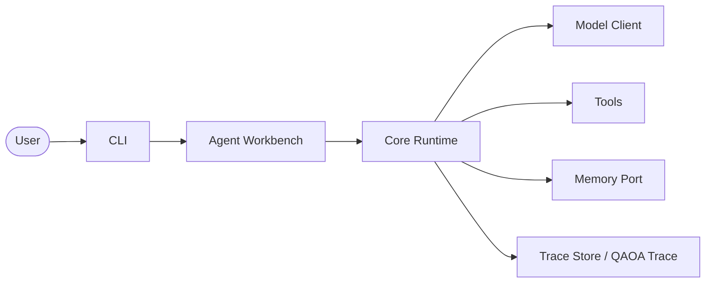

# Getting started with NAQSHA

This guide walks from zero to a traced run using the **Agent Workbench** CLI, then shows how to replay a **QAOA Trace** and how to smoke-test with the bundled **`local-fake`** **Run Profile** without initializing a project.

Terminology matches [CONTEXT.md](../../CONTEXT.md): **NAQSHA**, **Core Runtime**, **Agent Workbench**, **QAOA Trace**, **NAP Action**, **Memory Port**, **Tool Policy**, **Approval Gate**, **Run Profile**.

## How the pieces connect

At a high level, the CLI is the entry point; the **Agent Workbench** is the workflow layer (profiles, traces, eval, reflection); the **Core Runtime** executes each turn and persists a **QAOA Trace**. Models, tools, and **Memory Port** adapters plug in behind that runtime.



For a single `naqsha run`, the CLI resolves your **Run Profile** and builds the **Core Runtime**; tool output is treated as **Untrusted Observation** and is sanitized before it reaches the trace, **Memory Port**, or the model again—see **Observation Sanitizer** in [CONTEXT.md](../../CONTEXT.md).

## Prerequisites

| Requirement | Notes |
|-------------|--------|
| **Python** | 3.11 or 3.12 (`requires-python = ">=3.11"` in the package). |
| **Shell** | Any POSIX shell; examples use `bash`-style here-docs and `cd`. |
| **Network** | Optional for **`local-fake`**; required when your **Run Profile** uses a remote **Model Client**. |

## Install for users (pip)

Install from PyPI:

```bash
python -m pip install naqsha
```

Confirm the console script:

```bash
naqsha --version
```

## Install for contributors (uv, dev extras)

From a clone of the repository:

```bash
cd /path/to/naqsha
uv sync --extra dev
```

Run tests and lint (maintainer workflow):

```bash
uv run --extra dev pytest
uv run --extra dev ruff check .
```

Use `uv run naqsha …` if you prefer not to activate a virtualenv.

## Initialize an Agent Workbench project

`naqsha init` creates `.naqsha/` with:

| Path | Role |
|------|------|
| `.naqsha/profiles/` | **Run Profile** files (JSON/TOML); paths inside a profile resolve relative to that file’s directory. |
| `.naqsha/traces/` | Append-only **QAOA Trace** JSONL files (**Trace Store**). |
| `.naqsha/evals/` | Saved eval fixtures. |
| `.naqsha/reflection-workspaces/` | Isolated **Reflection Patch** workspaces (human review; nothing auto-merges into the **Core Runtime**). |

From an empty project directory:

```bash
mkdir my-agent && cd my-agent
naqsha init
```

By default this creates **Run Profile** `.naqsha/profiles/workbench.json`, copied from the bundled **`local-fake`** profile shape and renamed to `workbench`, with `trace_dir` and `tool_root` set for your tree. The command prints JSON including the profile path.

Optional: choose another profile stem:

```bash
naqsha init --profile-name myprofile
# Then: naqsha run --profile myprofile "hello"
```

## First run with the workbench profile

With your current working directory at the project root (where `.naqsha/` exists):

```bash
naqsha run --profile workbench "ping"
```

### Machine-readable JSON (default)

Without flags, **stdout** is a single JSON object suitable for scripts:

| Field | Meaning |
|-------|---------|
| `run_id` | Identifier for this run’s **QAOA Trace** file under the profile’s `trace_dir`. |
| `answer` | Final model answer text, if any. |
| `failed` | Whether the run ended in a failure state. |

**Stderr** may include a replay hint after a successful run (unless you pass `--no-hint`):

```text
naqsha: hint: naqsha replay --profile 'workbench' <run_id>
```

### Human-readable output (`--human`)

For terminal use, print only the answer:

```bash
naqsha run --profile workbench --human "what time is it?"
```

In `--human` mode you do **not** get the JSON `run_id` on stdout; use the stderr hint, the trace directory, or rerun without `--human` when you need the id.

### JSON vs `--human` (summary)

| Mode | stdout | Typical use |
|------|--------|-------------|
| Default | JSON: `run_id`, `answer`, `failed` | Scripts, CI, jq |
| `--human` | Plain answer text (or `(no answer)` on stderr) | Interactive terminal |

## Finding `run_id`

| Source | How |
|--------|-----|
| **JSON stdout** | Parse the `run_id` field from `naqsha run` without `--human`. |
| **Stderr hint** | After a successful run, copy the id from the `naqsha replay …` hint. |
| **Trace Store** | Files are named `{run_id}.jsonl` under the resolved `trace_dir` (for **`workbench`**, typically `.naqsha/traces/`). |
| **`replay --latest`** | Resolve the most recently modified trace in `trace_dir`—no id on the command line. |

Example listing (paths depend on your profile):

```bash
ls -lt .naqsha/traces/
```

## Replay a trace (`replay --human`)

Summarize a prior run for quick reading:

```bash
naqsha replay --profile workbench <run_id> --human
```

You get a short text summary: `run_id`, queries, observation count, answer, and failures.

Shorthand for the latest trace file in `trace_dir`:

```bash
naqsha replay --profile workbench --latest --human
```

For structured inspection (default), omit `--human` to print JSON.

> **Note:** `replay --re-execute` re-runs the **Core Runtime** with recorded model turns and stored observations (no live tools for approved replay paths). That mode is geared at regression and debugging, not casual reading—see `naqsha replay --help`.

## Bundled `local-fake` without `init`

The CLI default profile is **`local-fake`**. It is bundled in the `naqsha` package, so you can smoke-test the **Core Runtime** and CLI from any directory without `.naqsha/`:

```bash
naqsha run --profile local-fake "what time is it?"
```

Explicit default (same behavior if you omit `--profile`):

```bash
naqsha run "what time is it?"
```

After **`naqsha init`**, prefer **`--profile workbench`** (or your chosen name) so traces and profiles live under your project’s **Trace Store** and **Run Profile** layout.

## Next steps

| Goal | Command or doc |
|------|------------------|
| Inspect **Tool Policy** and resolved profile | `naqsha profile show --profile workbench` (alias: `naqsha inspect-policy`) |
| List tools and risk metadata | `naqsha tools list --profile workbench` |
| Example remote profiles | [examples/profiles/README.md](../../examples/profiles/README.md) |
| Vocabulary and architecture terms | [CONTEXT.md](../../CONTEXT.md) |
| Eval fixtures and reflection | [README.md](../../README.md) (Agent Workbench / CLI cheat sheet) |

---

[← User documentation hub](./README.md)
