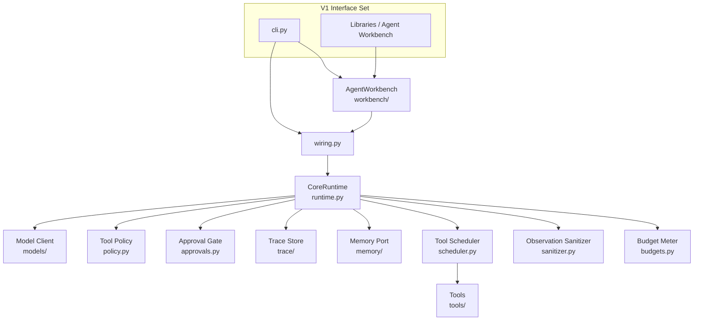
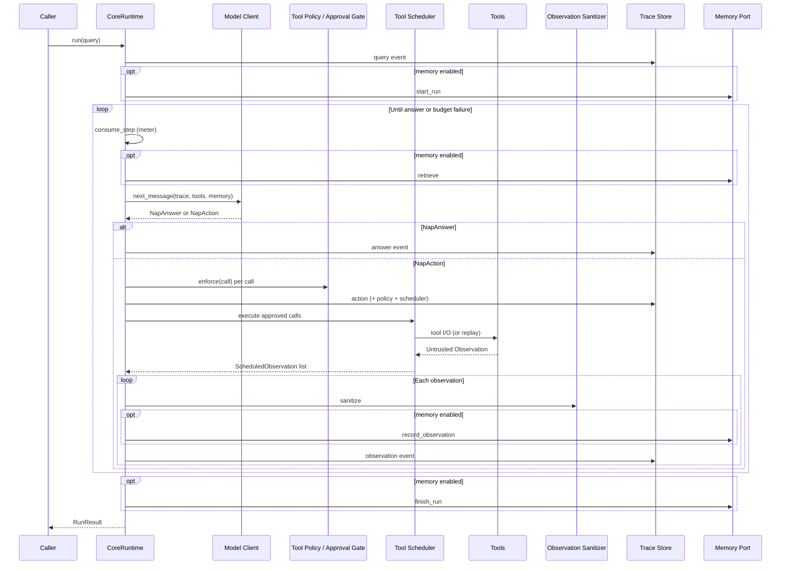

# Architecture and concepts

This guide explains how **NAQSHA** is structured around a small **Core Runtime**, what the **Agent Workbench** adds for day-to-day workflows, and the main runtime concepts: **NAP Actions**, **QAOA Trace**, **Tool Scheduler**, **Untrusted Observations**, **Observation Sanitizer**, **Budget Limits**, and **Memory Port** adapters. Terminology follows `CONTEXT.md`; file paths point at the implementation.

---

## Layers: Core Runtime, Agent Workbench, and CLI

NAQSHA separates *execution semantics* (one place) from *how you invoke and wrap* those semantics (CLI and library façade).

| Layer | Responsibility | Primary modules |
| ----- | -------------- | ----------------- |
| **Core Runtime** | Owns a single run’s loop: **Model Client** calls, **Tool Policy** enforcement, **Approval Gate** checkpoints, **Tool Scheduler** execution, **Observation Sanitizer**, **Trace Store** persistence, optional **Memory Port** I/O, and **Budget Limits** (fail closed). | `runtime.py` (`CoreRuntime`, `RuntimeConfig`) |
| **Agent Workbench** | Library façade: load **Run Profiles**, build a wired `CoreRuntime` via shared construction, run queries, summarize traces, eval/replay helpers, reflection entry points—**without importing** `cli.py` for runtime construction. | `workbench/__init__.py` (`AgentWorkbench`), `wiring.py` (`build_runtime`, `build_trace_replay_runtime`, `inspect_policy_payload`) |
| **CLI** | Argument parsing and dispatch: subcommands call into `wiring` and `AgentWorkbench`; it does not define execution rules. | `cli.py` |

Conceptually: the **V1 Interface Set** is Python library + CLI; both use **`naqsha.wiring`** (and embedders typically import from `naqsha.wiring` or root re-exports per `AGENTS.md`).

---

## NAP Actions and why they matter

A **NAP Action** is the strict, validated envelope the **Core Runtime** understands for “do tools” vs “finish.” Provider-specific chat or tool formats are translated by **Model Client** adapters into **`NapAction`** / **`NapAnswer`** instances defined in **`protocols/nap.py`** (`parse_nap_message`, `ToolCall`, `NapAction`, `NapAnswer`).

**Why it matters:**

- The runtime consumes **only** validated NAP messages—no accidental leakage of raw provider payloads into execution logic.
- A **NAP Action** expresses one or more **Tool Calls** with stable `id`, `name`, and `arguments`; a **NAP Answer** is a single final text. Unexpected fields are rejected at validation time (**`NapValidationError`**).
- This is **not** a free-form instruction channel: design intentionally avoids treating model prose as executable policy—**Tool Policy** is enforced in **`policy.py`** (**`CoreRuntime`** calls **`ToolPolicy.enforce`** per call in **`runtime.py`**).

Rough shape (conceptual; see `protocols/nap.py` for the full rules):

| `kind`   | Meaning | Key fields |
| -------- | ------- | ---------- |
| `action` | Request tool execution | Non-empty `calls` array (`id`, `name`, `arguments`) |
| `answer` | Terminal user-facing reply | Non-empty `text` |

---

## QAOA Trace (append-only JSONL)

Every run produces a **QAOA Trace**: an ordered sequence of **Query**, **Action**, **Observation**, and **Answer** events (plus **failure** when budgets or other failures end the run). This is **not** a provider-native chat transcript; it is NAQSHA’s canonical record for inspectability and replay.

- **Persistence:** **`trace/`** owns storage; v1 defaults to **`JsonlTraceStore`** in **`trace/jsonl.py`** (append-only JSONL under the configured trace directory—often `.naqsha/traces/` in an agent project).
- **Protocol:** Event shape and helpers live in **`protocols/qaoa.py`**. Each JSONL row can carry **`schema_version`** so disk format can evolve safely: **`QAOA_TRACE_SCHEMA_VERSION`** and **`_SUPPORTED_SCHEMA_VERSIONS`** gate what loaders accept; **`schema_version` omitted on disk is treated as version `1`** (documented at the top of `protocols/qaoa.py`).
- **Runtime writes:** **`CoreRuntime.run`** appends **`query_event`**, **`action_event`**, **`observation_event`**, **`answer_event`**, or **`failure_event`** (`runtime.py`), always after policy and sanitization paths where applicable.

Typical **action** payloads include **`policy`** decisions per call and **`scheduler`** metadata (`mode`: `serial` | `parallel`, `parallel_eligible`), matching validation in **`protocols/qaoa.py`**.

---

## Tool Scheduler, Untrusted Observations, and Observation Sanitizer

### Tool Scheduler

The **Tool Scheduler** (**`scheduler.py`**, `ToolScheduler`) executes **approved** tool calls from a **NAP Action** after **Tool Policy** and **Approval Gate** resolution.

- **Serial (default):** Conservative path when parallel execution is not allowed.
- **Parallel:** Only when there is **more than one** approved call, **all** corresponding tools are **`read_only`** per tool spec, and **tool names are unique** within the batch (`can_parallelize`). Otherwise execution uses a single-worker path (still implemented with a pool for uniform timeout handling).
- **Per-tool time:** When a **`BudgetMeter`** is supplied, **`BudgetLimits.per_tool_seconds`** caps each tool invocation; overruns yield a structured failing **Untrusted Observation** (timeout metadata).
- **Replay:** **`ToolScheduler(recorded_observations=...)`** can replay **Untrusted Observation** payloads by **call id** without live tool I/O (used from trace replay wiring).

Scheduler choices are echoed on trace **action** events under **`scheduler`**.

### Untrusted Observation

Every tool result is an **Untrusted Observation** (**`ToolObservation`** in **`tools/base.py`**): content may inform the **Model Client** on the next step but **must not** be interpreted as instructions to the **Core Runtime** (no “tool tells the runtime what to do”).

### Observation Sanitizer

Before observations are persisted, written to the **Memory Port**, or folded back into model context, they pass through the **Observation Sanitizer** (**`sanitizer.py`**, **`ObservationSanitizer`**): secret-like patterns are redacted, oversized content is truncated (with metadata). Denied-policy synthetic observations are sanitized the same way in **`runtime.py`**.

---

## Budget Limits (fail closed)

**Budget Limits** (**`budgets.py`**, **`BudgetLimits`**) are **hard caps**, not hints. **`BudgetMeter`** tracks consumption; exceeding **max steps**, **max tool calls**, or **wall-clock** time raises **`BudgetExceeded`**, which **`CoreRuntime.run`** catches and records as a **failure** trace event (`failure_code` **`budget_exceeded`** on **`RunResult`**) **without** treating exhaustion as advisory.

**`BudgetLimits`** also defines **`per_tool_seconds`**; when **`CoreRuntime`** passes a **`BudgetMeter`** into **`ToolScheduler.execute`**, each tool invocation is bounded by that timeout (failed calls become structured **Untrusted Observations**). **`max_model_tokens`** is accepted on **`BudgetLimits`** and **Run Profiles** (**`profiles.py`**) but is **not** applied inside **`BudgetMeter`** today—see **`budgets.py`** for what the meter enforces on each run.

---

## Memory Port adapters (high level)

The **Memory Port** (**`memory/base.py`**) is the **Core Runtime** contract for optional durable memory (**not** “chat history”): **`start_run`**, **`retrieve`** (token-budgeted), **`record_observation`** (sanitized), **`finish_run`**.

**Run Profile** field **`memory_adapter`** (validated in **`profiles.py`**) selects:

| Value | Behavior | Implementation |
| ----- | -------- | -------------- |
| **`none`** | No memory port; runtime runs with `memory=None`. | `wiring.build_runtime` leaves memory unset. |
| **`inmemory`** | Ephemeral, in-process memory for tests/smoke. | **`memory/inmemory.py`** (`InMemoryMemoryPort`) |
| **`simplemem_cross`** | Local SQLite + Cross-style lifecycle (**SimpleMem-Cross Adapter**). | **`memory/simplemem_cross.py`** (`SimpleMemCrossMemoryPort`) |

Library users can also construct **`CoreRuntime(RuntimeConfig(..., memory=...))`** directly with any **`MemoryPort`** implementation.

---

## Execution loop (Query → Action → Observation → Answer)

At a high level, **`CoreRuntime.run`** (**`runtime.py`**):

1. Appends a **query** event; starts memory run if configured.
2. Loops until a **NAP Answer** or failure:
   - Consumes one **step** from the meter (fail closed if over budget).
   - **Retrieves** memory (bounded by **`memory_token_budget`**).
   - Asks **`model.next_message`** with query, trace snapshot, tool specs, and memory.
   - If **`NapAnswer`**: append **answer** event and exit success path.
   - If **`NapAction`**: **enforce Tool Policy** per call; persist **action** with decisions + scheduler metadata; for denied calls persist **sanitized observations** without executing tools; **consume tool-call budget** for each approved call; **execute** via **Tool Scheduler**; **sanitize** each observation; optionally **record** to memory; append **observation** events.
3. On **`BudgetExceeded`**, append **failure** and return **`failed=True`**.
4. **finish_run** memory in a `finally` block.

---

## Related reading

| Topic | Where |
| ----- | ----- |
| Glossary & relationships | `CONTEXT.md` |
| Product intent & Agent Workbench | `docs/prd/0001-naqsha-v1-runtime.md` |
| Module ownership & invariants | `AGENTS.md` |
| Replay with recorded observations | `replay.py`, `wiring.build_trace_replay_runtime` |

---

## Summary table

| Concept | Role |
| ------- | ---- |
| **Core Runtime** | Single source of execution semantics (`runtime.py`). |
| **Agent Workbench** | Profile-aware façade over wiring + traces + eval/reflection (`workbench/`). |
| **CLI** | Parses args; dispatches to `wiring` / `AgentWorkbench` (`cli.py`). |
| **NAP Action / NAP Answer** | Validated model→runtime envelope (`protocols/nap.py`). |
| **QAOA Trace** | Append-only canonical run log, JSONL by default (`protocols/qaoa.py`, `trace/`). |
| **Tool Scheduler** | Serial vs conservative parallel scheduling (`scheduler.py`). |
| **Untrusted Observation** | Tool output for the model only; never runtime authority (`tools/base.py`). |
| **Observation Sanitizer** | Redaction/size limits before trace/memory/model (`sanitizer.py`). |
| **Budget Limits** | Hard caps; exhaustion fails closed (`budgets.py`). |
| **Memory Port** | Optional durable memory adapters (`memory/`, **`profiles.memory_adapter`**). |

This mental model stays stable as you customize **Run Profiles**, swap **Model Clients** under **`models/`**, or extend tools under **`tools/`**—the **Core Runtime** loop remains the spine of every run.
